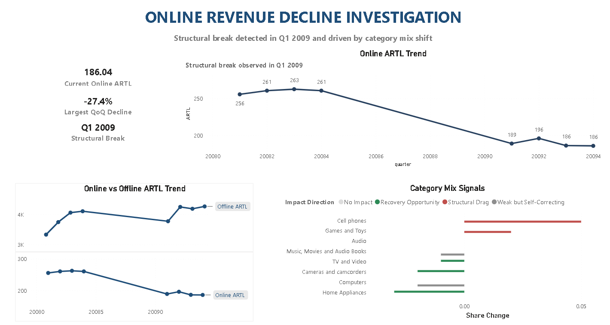
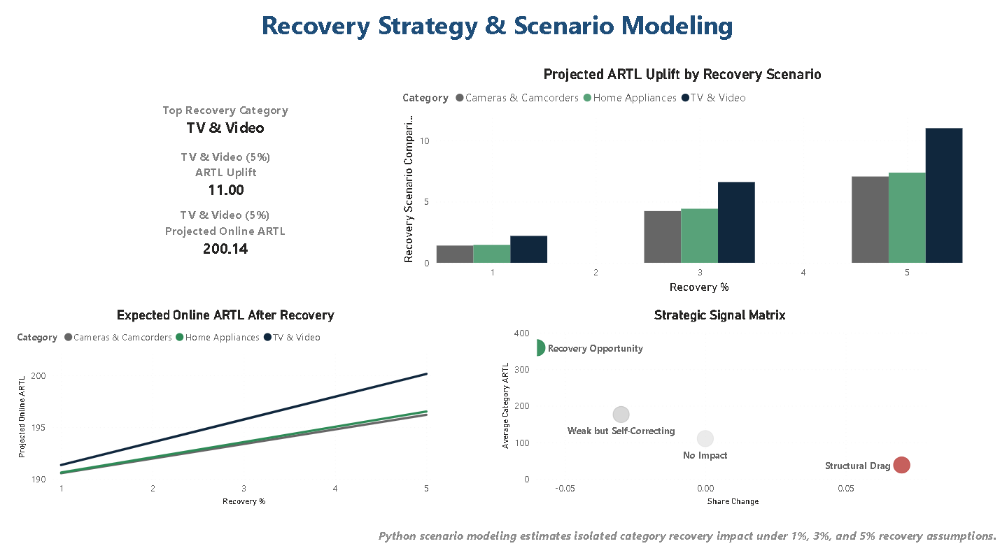

# Contoso Revenue Decline Investigation
### End-to-End Business Investigation using SQL, Python & Power BI

> An end-to-end business investigation combining SQL, Python, and Power BI to identify the structural drivers of Online revenue quality deterioration and evaluate category recovery strategies.

---

## Business Problem

Contoso experienced a decline in Online revenue quality despite relatively stable pricing conditions.

The investigation aims to answer three key business questions:

- Is the decline driven by pricing or structural category mix changes?
- Is the deterioration isolated to Online or affecting the entire business?
- Which product categories should be prioritized to maximize revenue quality recovery?

---

## Investigation Framework

The project follows a structured six-stage analytical approach.

| Stage | Objective |
|------------|---------------------------------------------|
| **Stage 1** | Root Cause Investigation |
| **Stage 2** | Structural Break Validation |
| **Stage 3** | Channel Validation |
| **Stage 4** | Strategic Category Classification |
| **Stage 5** | Business Recommendations |
| **Stage 6** | Python Scenario Modeling |

---

## Tech Stack

- **SQL (PostgreSQL)** – Root cause investigation & hypothesis validation
- **Python (Pandas)** – Recovery scenario modeling
- **Power BI** – Executive dashboard & business storytelling
- **Excel** – Validation & supporting calculations

---

## Dataset

**Source:** Microsoft Contoso Retail Dataset

**Analysis Period:** 2008–2009

**Focus:** Online revenue quality deterioration

**Primary Metric:** Average Revenue per Transaction Line (ARTL)

> ARTL is used as a proxy for Average Order Value because Offline order-level identifiers are unavailable within the dataset.

---

# Key Findings

### 1. Revenue deterioration is structural rather than pricing-driven.

Standard ARTL declined alongside Actual ARTL, demonstrating that deterioration persists even after removing pricing effects.

---

### 2. Q1 2009 represents a clear structural break.

Quarter-over-quarter analysis identified the largest Online ARTL decline in **Q1 2009**, indicating a significant shift in revenue quality rather than a gradual trend.

---

### 3. The issue is isolated to the Online channel.

Offline ARTL remained comparatively stable while Online ARTL experienced substantial deterioration, confirming an Online-specific business problem.

---

### 4. Strategic category signals reveal clear priorities.

**Recovery Opportunities**

- TV & Video
- Home Appliances
- Cameras & Camcorders

**Structural Drags**

- Cell Phones
- Games & Toys

**Weak but Self-Correcting**

- Audio
- Computers

---

# Business Recommendations

Based on the investigation:

### Prioritize Recovery Opportunities

Focus merchandising and assortment optimization efforts on:

- TV & Video
- Home Appliances
- Cameras & Camcorders

These categories exhibit high revenue quality and offer the strongest recovery potential.

---

### Reduce Structural Drags

Cell Phones and Games & Toys continue gaining transaction share despite generating relatively low revenue quality, creating structural pressure on Online ARTL.

---

### Optimize Category Mix

Rather than pursuing transaction volume alone, prioritize a healthier category mix capable of improving long-term revenue quality.

---

# Python Scenario Modeling

To evaluate recovery strategies, Python was used to simulate isolated category recovery scenarios under:

- **1% Recovery**
- **3% Recovery**
- **5% Recovery**

Each scenario estimates the contribution of a single Recovery Opportunity category to overall Online ARTL improvement.

### Best Scenario

| Category | Recovery | Projected Online ARTL | Uplift |
|----------------|-----------|----------------|-----------|
| **TV & Video** | **5%** | **200.14** | **+11.00** |

---

# Dashboard Preview

## Page 1 — Online Revenue Decline Investigation



---

## Page 2 — Recovery Strategy & Scenario Modeling



---

# Repository Structure

```
analysis.sql
scenario_model.py
artl_recovery_scenarios.csv
contoso-business-investigation-dashboard.pbix
online-revenue-decline-dashboard.png
recovery-strategy-dashboard.png
archive/
```

---

# Key Analytical Assumptions

- ARTL is used as a proxy for Average Order Value due to unavailable Offline order identifiers.
- Recovery scenarios model isolated category improvements and do not assume category-to-category customer migration.
- Scenario modeling estimates uplift efficiency under **1%, 3%, and 5% recovery assumptions**.
- Analysis covers **2008–2009** Contoso Retail data.

---

# Repository Contents

| File | Description |
|------------------------------|-------------------------------------------|
| **analysis.sql** | Complete SQL investigation |
| **scenario_model.py** | Python recovery scenario modeling |
| **artl_recovery_scenarios.csv** | Python model output |
| **contoso-business-investigation-dashboard.pbix** | Interactive Power BI dashboard |
| **online-revenue-decline-dashboard.png** | Dashboard Page 1 |
| **recovery-strategy-dashboard.png** | Dashboard Page 2 |

---

# Project Evolution

An earlier version of this analysis is preserved under **/archive/v1-revenue-analysis** for reference.

The current investigation supersedes that version with:

- Structured hypothesis-driven SQL investigation
- Strategic category classification
- Python scenario modeling
- Two-page executive Power BI dashboard
- End-to-end business recommendations

---

## Final Conclusion

The investigation demonstrates that Online revenue quality deterioration is primarily driven by **structural category mix changes rather than pricing effects**.

By prioritizing high-value Recovery Opportunity categories, the modeled strategy estimates that Online ARTL can improve from **189.14** to approximately **200.14**, providing a clear, data-driven direction for revenue quality optimization.
