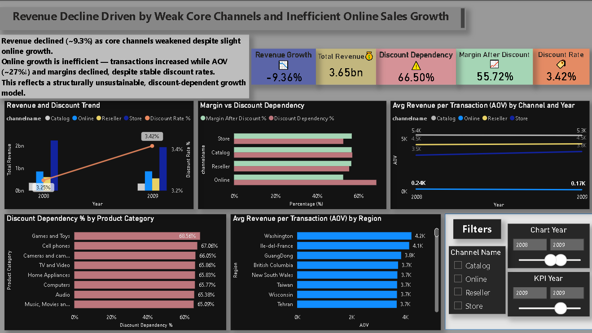

# Contoso Revenue Analysis: Revenue Decline Driven by Weak Core Channels and Inefficient Online Growth

> End-to-end business analysis using SQL, Power BI, and Excel to diagnose drivers of revenue decline and evaluate growth sustainability.

## 📊 Business Problem

Is Contoso’s revenue decline driven by weakening core channels, or is online growth masking deeper inefficiencies?

---

## 🎯 Objectives

- Identify discount dependency across channels and categories  
- Analyze whether growth is driven by volume or value  
- Evaluate relationship between discounting and profitability  
- Assess sustainability of current growth strategy   

---

## 🛠️ Tools Used

- SQL (PostgreSQL)  
- Power BI  
- Excel  

---

## 📦 Dataset
- Source: Contoso Retail Dataset (Microsoft sample dataset)
- Period: 2008–2009
- Database: PostgreSQL
- Tables used: 11 (sales, online_sales, channel, product, promotion, date, geography, store, sales_territory, product_category, product_subcategory)

---

## 🧹 Data Cleaning
- Fixed spelling error "Back-to-Scholl" → "Back-to-School" in promotion table via view
- Standardized 295 blank status values to 'Unknown' in product table via view
- Excluded salesamount = 0 rows (65,271 returns in online_sales)
- Verified referential integrity across all 4 critical foreign keys — all clean
- Weight column dropped — irrelevant to business problem

---
## 🧠 Approach

- Combined online and offline sales data using SQL  
- Analyzed transaction-level metrics to evaluate AOV and discount dependency  
- Compared margin trends before and after discount across channels  

---

## 📷 Dashboard Preview

---

## 🔍 Key Insights

- Revenue declined ~9.3%, driven primarily by weakening core channels  
- Online growth is volume-driven but inefficient:
  - Transactions increased 38% (2008→2009)  
  - AOV dropped ~27%  
  - Margins declined despite stable discount rates   
- Discount dependency remains high (~66%)  
- Core channels are declining sharply, outweighing limited gains from online growth  

---

## ⚠️ Data Limitations
- AOV calculated at transaction line level as offline sales lack order-level granularity
- Analysis covers 2008–2009 only — long-term trends require additional years

---

## 💡 Conclusion

The business is shifting toward a volume-driven online growth model that increases transactions but reduces value per sale.

This indicates a structurally unsustainable growth pattern and highlights a key business risk — continued reliance on such growth may erode profitability further.

---

## 🚀 Business Implications

- Growth strategy should shift from volume to value optimization  
- Reduce dependency on discount-driven sales in Online channel  
- Focus on improving AOV through pricing, bundling, or product mix  
- Stabilize core channels to prevent further revenue decline  

---

## 📁 Repository Structure

- `analysis.sql` → SQL queries for all business questions  
- `contoso-revenue-analysis.pbix` → Power BI dashboard  
- `supporting-analysis.xlsx` → Excel validation & pivots  
- `dashboard.png` → Dashboard preview  
